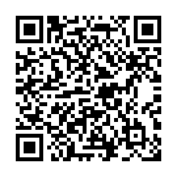
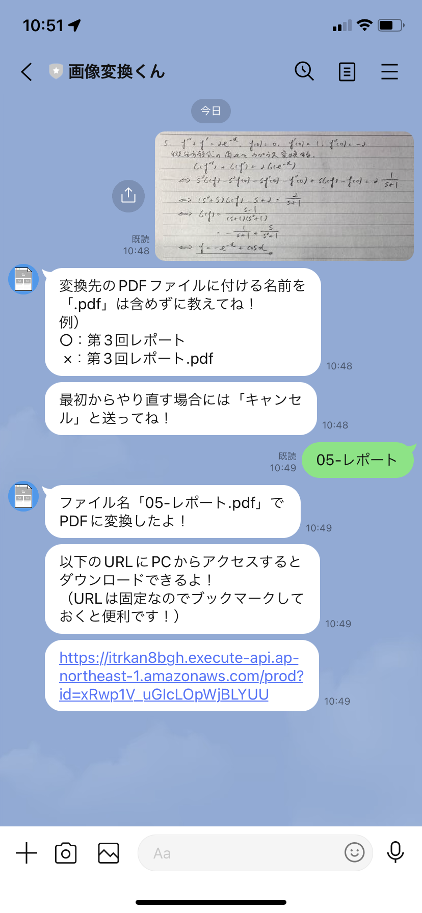

<h1>LINE Bot 画像変換くん</h1>

<!-- ABOUT THE PROJECT -->
## このプロジェクトについて

LINEのチャットに送られてきた画像を、指定したファイル名でPDFに変換するボットです。 

下のQRコードからLINEで友だち登録することで、実際にボットを使うことができます。 

(<a href="#top">back to top</a>)

## スクリーンショット

## 作ったきっかけ
* 大学の課題を提出する際に、「携帯で撮影したレポートの写真を**PDFに変換して提出**」するケースが多い。
* 携帯からPCに画像を転送 & 画像をPDFに変換するのが面倒なので、この手順を楽にしたいと思った。

(<a href="#top">back to top</a>)

## 使用技術
